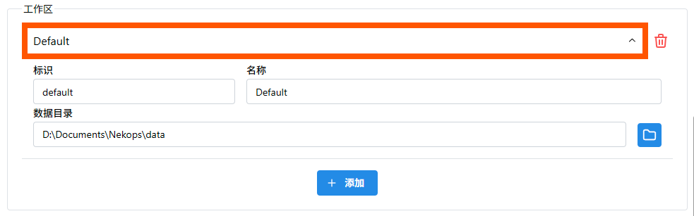

# 一切皆在掌控中

::: tip 能工智人为您总结

在此篇文章中，您将了解到如何添加一个新的工作区，并使用版本管理工具来同步它。

:::

前往 设置 页面，向下滚动到 工作区 区域，我们可以查看所有的工作区。

点击工作区的名称，即可展开查看这个工作区的详细信息。

Nekops 默认会在当前用户的文档目录[^document-in-disk-d]下创建 Nekops 目录（这里同时也是总配置文件的存储目录），并以其中的 data 目录作为数据目录。

可以在这里找到我们刚才创建的服务器：

但您或许并不一定希望在这个目录管理它们。 Nekops 支持添加多个工作区，所以我们可以创建一个新的，放置在我们喜欢的位置。

回到 设置 页面，点击 工作区 区域下的 **添加** 按钮：

系统会创建一个新的标识为 default ，名称为 Default ，目录为 nekops_data 的工作区。同样通过点击名称来展开它，我们可以查看详细信息：

将它修改成我们想要的内容，例如：

- 标识 `example`
- 名称 `芝士样例`

然后点击 数据目录 输入框右侧的 文件夹图标的按钮，选择一个希望存储数据的目录：

点击 **保存** 按钮来确认设置变更：

这样，我们的新工作区就创建完成了。

我们可以在 控制栏 切换工作区：

切换到新的工作区后，由于这是一个新的工作区，所以里面什么数据都没有。

您可以仿照[之前的步骤]，添加一个服务器。

[之前的步骤]: /quickstart/hello-server/

当您添加好服务器后，我们前往这个数据目录，可以看到结构相同的内容：

您可以像使用任何一个工作区那样使用它。您也可以创建任意多个工作区，以方便您的使用。

由于使用了纯文本友好的数据存储格式，我们可以使用一些版本管理工具来管理它们，例如 git ：

当然，您也可以把它设置在同步网盘里，以方便您的使用。

::: info 数据目录中的内容

数据目录不包括工作区的名称，只包含了其中的数据（服务器等）。如果您需要在另一台设备上设置同步的工作区，您需要手动设置相同的名称，并为它设置同步的目录。

:::

[^document-in-disk-d]: 我的开发机用了好多年了，当时装系统的时候用了系统盘数据盘分离的策略，后来就一直没去改过它。如果是只有一个物理硬盘的电脑，建议还是使用系统默认的分配方案，拆开反而还影响性能。
