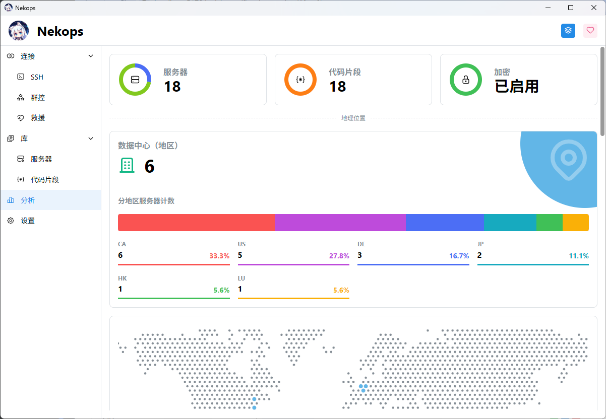

# 第一印象

::: tip 能工智人为您总结

在此篇文章中，您将了解到软件界面的划分，并大致了解各个页面的用途。

:::

## 主视窗

Nekops 启动时，最先出现的窗口是 [主视窗](/window/main/) 。这里是核心的管理区域，包含所有的资源数据，以及在需要时启动其他视窗的功能。

主视窗的结构为上下结构：

- 顶部是控制栏：
  - 左侧为软件的 LOGO 和名字；
  - 右侧为控制区域，包含两个按钮：切换工作区、打开 **关于** 模态框；
- 下部为左右结构：
  - 左侧为导航区域，负责在不同 [页面](/page/) 间切换；
  - 右侧为当前的页面内容区域，包含了当前页面的所有内容，在不同页面切换时该部分会发生变化。

### 首页

作为一个运维管理工具，我希望它能在该高效的时候高效，所以比起想办法拼凑元素做出一个打开就是为了关闭的首页，我还是直接让它成为 SSH 的功能区，其内容是*所有服务器*[^not-every-server]的铭牌序列。

每一个服务器铭牌分为左右两部分，左边为基础信息，右边为类型和主题色图标：

左侧的基础信息为从上到下的排布结构，各行内容依次为：

1. 名称 和 大写显示的标识符（仅截取至第一个 `.` 前）
2. 标签
3. 硬件资源

在首页右键服务器铭牌，可以弹出右键菜单：

但因为初次启动的应用里并没有任何服务器，所以在您看起来它会是空的，也就是什么都没有。不用担心，我[稍后](/quickstart/hello-server/)就会添加服务器。

### 群控

使用左侧的导航区域，我可以切换到下一个页面，也就是 群控 页面。

群控页面为左右结构：

- 左半边为标签页和矩阵管理：
  - 上部显示当前 [命令行视窗](/window/shell/) 里所有的标签页，以及它们的名称、矩阵位置、顺序和状态；
  - 底部是矩阵布局的控制按钮，可以选择添加行或列，也可以清理闲置的行或列。
- 右半边为指令管理：
  - 上半部为代码片段，点击代码片段可以将代码填写入下半部的命令输入框；
  - 下半部的命令输入框用于输入等待发送的命令；
  - 底部的按钮分别为添加特殊字符、发送功能选项、发送按钮。

启动时由于并没有标签页，所以左侧的列表会是空的，并且矩阵清理功能不会激活。不用担心，我[之后](/quickstart/power-of-multirun/)会使用到它。

### 救援

使用左侧的导航区域，我可以切换到下一个页面，也就是 救援 页面。

如果您启用了工作区的加密功能，那么救援页面在默认状态下将会是锁定的，您无法直接查看服务器的紧急访问相关信息。当您解锁后，它的结构会是像 SSH 页面那样的服务器铭牌列表，点击服务器铭牌即会弹出对应服务器的紧急访问信息，方便您参考使用。

同样地，我会在[之后](/quickstart/rescue-server/)使用到相关的功能。

### 服务器

使用左侧的导航区域，我可以切换到下一个页面，也就是 库 下属的 服务器 页面。

这个页面是所有服务器的管理页面，您可以对服务器进行 新增、删除、修改、查询 的操作。

### 代码片段

类似的，在 代码片段 页面可以对 代码片段 进行这些操作。

### 分析

使用左侧的导航区域切换到 分析 页面，我可以看到一些针对当前工作区里所有服务器的数据分析。

这里包含一些简单的分析，例如 地理位置、账单、资源，以方便您在有需要的时候审阅。如果您有其他的想法，也非常欢迎与我交流。

### 设置

使用左侧的导航区域切换到最后的 设置 页面，我就可以看到所有的设置选项了。

## 命令行视窗

当您使用 SSH 方式连接服务器时， Nekops 会自动启动一个新的视窗以方便您的管理，这就是 命令行 视窗。

命令行视窗支持矩阵模式显示，以方便您配合 群控 功能同时管理多个服务器。

在标签页的标签上右键，可以弹出右键菜单：

## 救援视窗

当您在救援模式下启动 VNC 客户端时， Nekops 会自动启动一个新的视窗以方便您的管理，这就是 救援 视窗。

但救援视窗不支持命令行视窗那样的矩阵管理。

在标签页的标签上右键，也同样可以弹出右键菜单：

## 结语

至此，您完成了 Nekops 所有视窗和页面的概览。如果您想了解更多实现上的细节，您可以参阅 [视窗](/window/) 和 [页面](/page/) 部分的描述，或是去代码仓库了解更多。

接下来的文档都将是实际使用导向的内容，期待能让您快速地掌握这个软件的正确打开方式。

<!-- 脚注 -->

[^not-every-server]: 其实并不是所有服务器，应该是所有 *包含了 SSH 连接地址* 的服务器（渲染时会做一次过滤，毕竟如果点击了但什么都没有发生可能会导致引发疑惑）。但因为这个暂时不影响理解，为了避免一瞬间引入太多难以理解的概念，就暂时先不多展开了。
