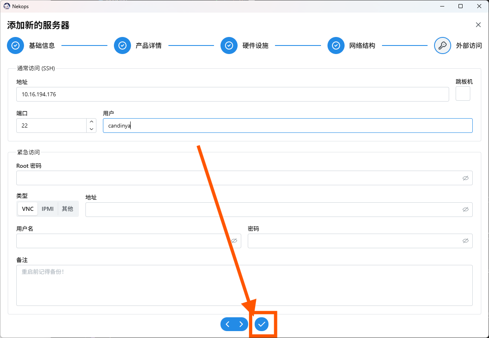
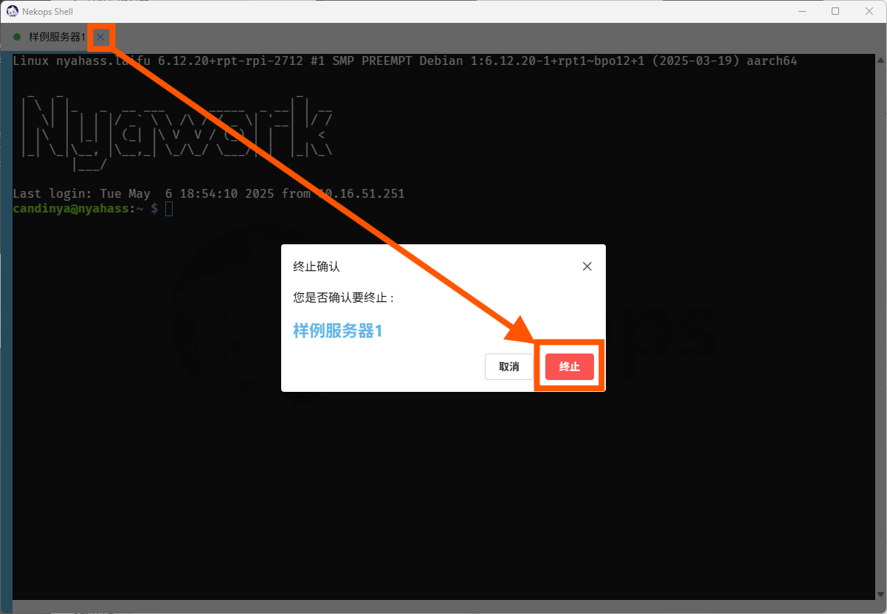

# 你好，服务器

::: tip 能工智人为您总结

在此篇文章中，您将了解到如何添加一个服务器，并通过 SSH 方式与它建立连接。

:::

## 添加一个服务器

Nekops 的服务器列表管理功能都在 库 - 服务器 页面。使用左侧的导航功能前往该页面，可以看到服务器的列表信息。初始情况下，这里没有任何的服务器。

点击页面搜索框右侧的加号按钮，可以打开新增服务器的模态框。

这个表单里包含了所有服务器相关的用于输入的信息，但我们可以先不用全部填写它们。

假设我们的服务器具有以下信息（请根据您的喜好和具体的服务器详情自行调整）：

- 标识为 `server-1.example`
- 名称为 `样例服务器1`
- SSH 地址为 `10.16.194.176`
- SSH 用户为 `candinya`

那么我们可以这样填写信息：

::: warning 不支持密码认证的服务器

出于安全考虑， Nekops 暂时没有添加对密码认证方式的支持。同时也暂时不支持带有密码保护的 SSH 密钥。这里使用的是没有密码保护的密钥（使用 id_ 开头的默认名称），放置在用户的默认 SSH 数据目录 `~/.ssh/` 下。

:::

填写完成后，我们点击完成，预览服务器铭牌。

确认无误后，点击 **保存** 按钮。

在服务器列表页，我们就能看到新增加的服务器了：

## 连接到服务器

前往 SSH 页面，我们可以看到新的服务器出现了：

点击服务器铭牌，软件会打开 命令行 视窗，并开始连接这个指定的服务器。

由于是首次连接到这个服务器，软件会提示这个新服务器的证书，并展示证书的指纹。确认证书没有问题后，可以选择 **接受** 来继续连接：

然后您就可以像使用一个一般的 SSH 客户端那样使用它了：

如果因为一些原因（例如超时或意外退出）导致会话结束，但您又不想再回去主视窗重新寻找服务器铭牌开启链接，您可以**右键**服务器标签页的空白位置，在弹出的菜单中选择 **重新连接** 来重新启动到服务器的连接会话。

当您想要结束会话但因为种种原因（例如远端卡死）导致无法正常结束时，您可以单击标签页右侧的终止按钮，并在弹出的终止确认框中确认终止。

