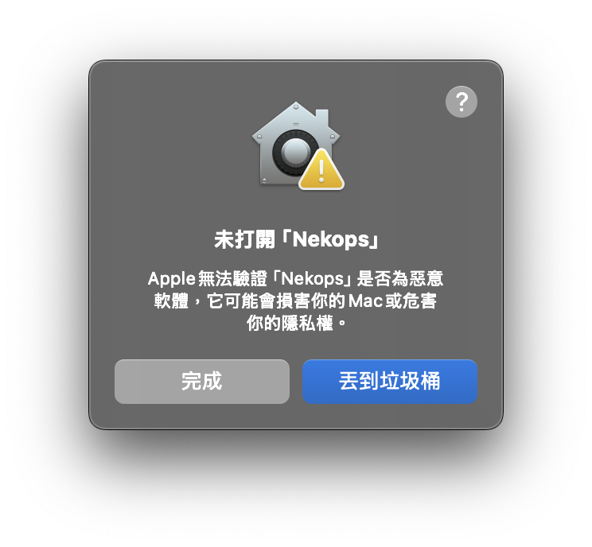
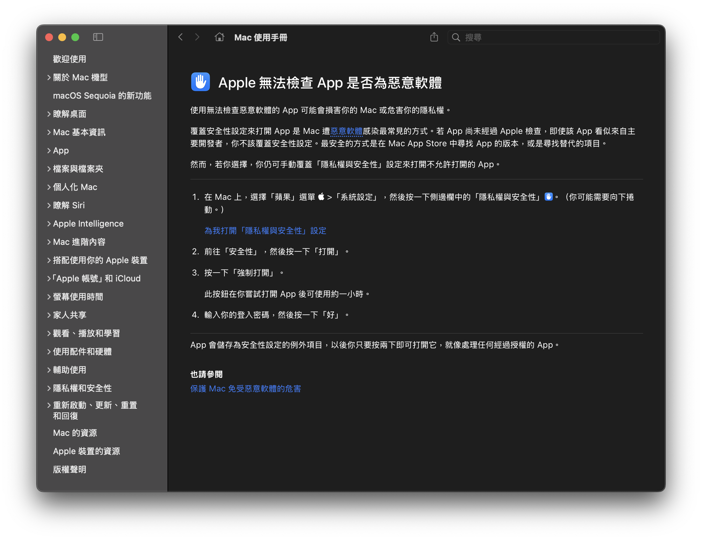
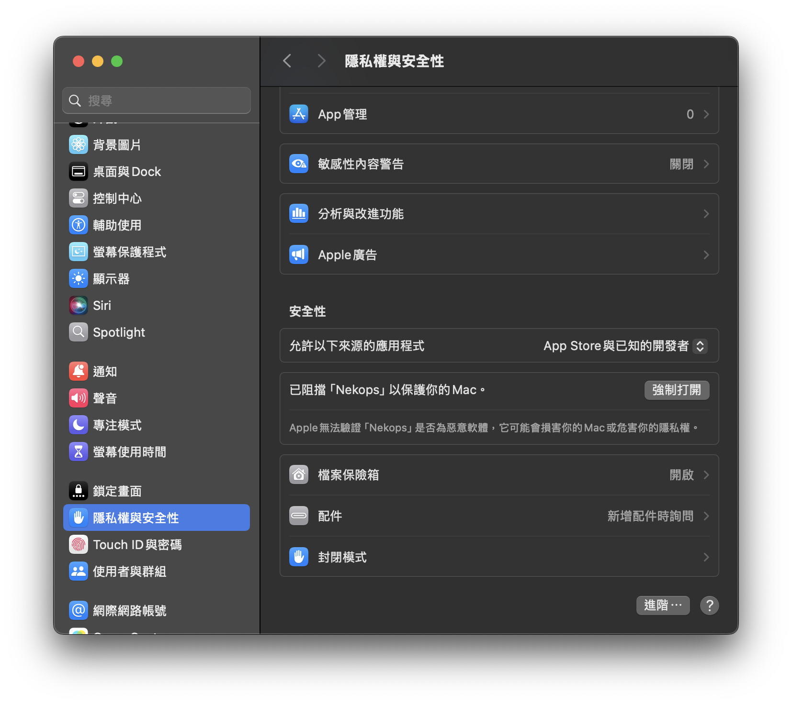
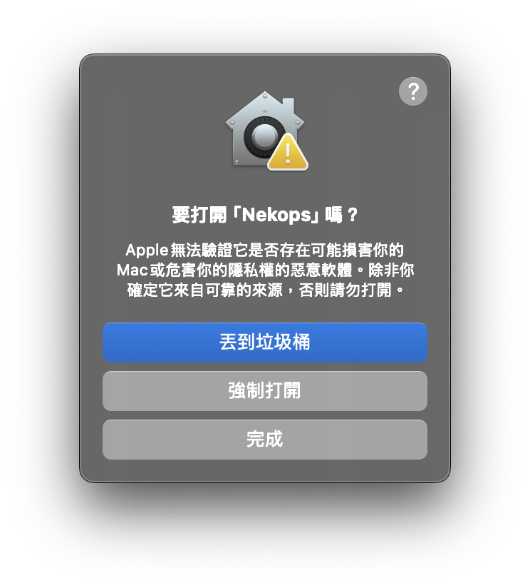
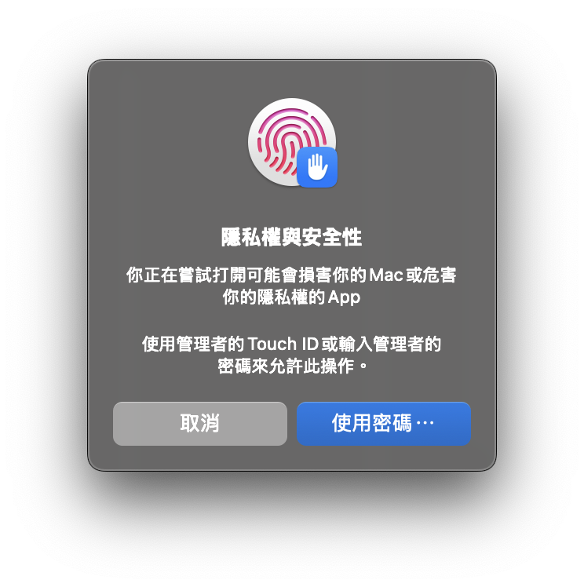

# 获取 Nekops

## 下载

目前 Nekops 提供两条发布渠道：

1. GitHub

   这是最正统的官方[发布渠道]，整套[构建流水线]都在这里，也因此直接将构建结果作为发布使用的二进制文件进行了打包。
   
   但由于 GitHub 服务器在不同地区的访问体验并不相同，有些用户可能会出现无法下载的情况，所以这作为最权威的参考发布渠道。

2. 代理服务器
   
   为了兼顾无法有效访问 GitHub 的地区，我针对它的构建结果搭建了一个简单的[代理服务]（目前是基于 CloudFlare Worker 的，如果之后资源消耗较高的话会改为自托管），以方便使用。

[构建流水线]: https://github.com/Candinya/nekops/blob/main/.github/workflows/build-artifacts.yml
[发布渠道]: https://github.com/Candinya/nekops/releases/latest/
[代理服务]: https://github.com/nekops-app/release-proxy-worker

它们用于下载构建结果的地址分别如下：

| 发布渠道 | Windows | MacOS (ARM) | Linux |
| --- | --- | --- | --- |
| GitHub | [EXE](https://github.com/Candinya/nekops/releases/latest/download/Nekops-windows-x64.exe) [MSI](https://github.com/Candinya/nekops/releases/latest/download/Nekops-windows-x64.msi) | [DMG](https://github.com/Candinya/nekops/releases/latest/download/Nekops-macos-aarch64.dmg) | [DEB](https://github.com/Candinya/nekops/releases/latest/download/Nekops-linux-x64.deb) [RPM](https://github.com/Candinya/nekops/releases/latest/download/Nekops-linux-x64.rpm) [AppImage](https://github.com/Candinya/nekops/releases/latest/download/Nekops-linux-x64.AppImage) |
| 代理 | [EXE](https://release.nekops.app/latest/Nekops-windows-x64.exe) [MSI](https://release.nekops.app/latest/Nekops-windows-x64.msi) | [DMG](https://release.nekops.app/latest/Nekops-macos-aarch64.dmg) | [DEB](https://release.nekops.app/latest/Nekops-linux-x64.deb) [RPM](https://release.nekops.app/latest/Nekops-linux-x64.rpm) [AppImage](https://release.nekops.app/latest/Nekops-linux-x64.AppImage) |

特别地，为了确保您下载得到的文件真实可信，请参考[项目证明]部分的说明，对它们执行确认。

[项目证明]: /notarize#项目证明

## 安装

各平台的分发文件都为平台优化的封装，直接执行对应的安装流程即可。

特别地，针对 Linux 平台的 AppImage 方式应该是包含了整套运行环境的免安装版本，您可以直接运行它。

## 运行

Windows 平台在安装后即可直接运行程序。

Linux 平台可以直接运行 AppImage ，或运行安装完成后的应用。

MacOS 平台由于苹果公司的安全策略设置问题，运行起来会有一些麻烦。如果您不确定如何使用，您可以参考以下流程：

::: details 在 macOS 上运行 Nekops

当您将应用程序安装完成后尝试运行时，您会得到如下图的提示信息：

您可以点击右上角的问号来确认详细信息：

其中提示您可以去系统设置中手动允许该程序的运行。打开系统设置，您会看到如图所示的内容：

当您点击 **强制打开** 按钮后，系统会弹出一个确认对话框，如图所示：

当您按下中间的 **强制打开** 按钮后，系统会要求您执行身份确认，如图所示：

当您输入密码后，应用程序即会得到运行批准。您可以像运行一个一般程序那样运行它。

使用应用程序内置的升级工具不会丢失得到的运行批准。如果您使用的是替换应用或删除再添加的方案，您可能需要手动重新批准一次。

:::
