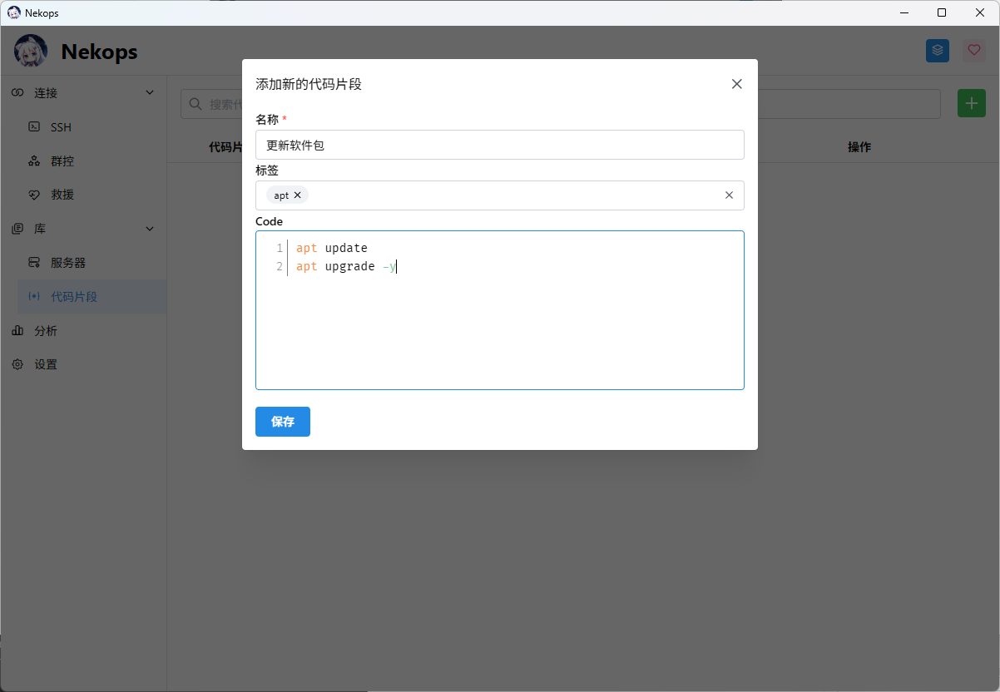

# 一呼百应的力量

::: tip 能工智人为您总结

在此篇文章中，您将了解到如何添加一个代码片段，并使用群控功能同时在多个服务器上执行命令。

:::

## 添加一个代码片段

有时候，我们需要对一系列的服务器执行相同的操作，例如更新软件包，或是调整某些设置。此处以更新软件包为例。

::: info 不同的包管理工具

我的服务器安装的都是 Debian 系统，所以它们的包管理工具都是 apt ，此处使用的命令都以 apt 为样例。如果使用的是不同系列的系统，您需要针对您的系统调整相关的命令。

:::

更新软件包的命令为：

```sh
apt update
apt upgrade -y
```

因为我们在之后可能也会使用到这些命令，所以我们可以把它存储为一条代码片段，方便后续也可以直接使用。

前往 代码片段 页面，点击页面搜索框右侧的加号按钮，可以打开新增代码片段的模态框。


我们给它取名为 `更新软件包` ，并设置一个标签为 `apt` ，就像这样：



点击 **保存** 按钮，我们就可以保存它。

## 连接到多个服务器

之后，我们依照之前[之前的步骤]，建立起与所有需要更新软件包的服务器的连接：

[之前的步骤]: /quickstart/hello-server/#连接到服务器


我们可以先在服务器中各自执行一些基础的指令（例如提权，让它们都能以 root 用户的身份准备执行后续的命令）：


前往 群控 页面，我们可以看见这些服务器的标签页，还有我们刚才添加的代码片段：


为了方便同时查看两个服务器的状态，此处以水平拆分为例。点击 **添加列** 按钮，将命令行视窗划分为左右部分：


鼠标左键按住其中一个服务器的标签页，将它拖放到右半边：


即可看到它被展示在了右半边：


同时，我们检查 群控 页面中的左半边，可以看到它展示出了标签页的矩阵位置：


这样，准备工作就都完成了。

## 同时在多个服务器上执行命令

我们可以点击服务器标签页前的方框来选择需要接受指令的服务器。


特别地，由于在此处我们需要向所有的服务器发送指令，我们也可以直接点击表头里的选择框，来一次选择所有的服务器：


点击右侧的代码片段表格中的项目，我们可以把代码片段快速地应用到命令输入框里：


如果我们需要对命令进行调整，也可以在输入框里直接编辑。

当准备就绪后，我们可以点击 **发送** 按钮，将命令发送给所有选中的标签页：


系统会提示我们命令发送成功：


同时，我们也可以看到服务器的状态变化：


