# 拯救大服务器

服务器在运行的时候总有可能出现意想不到的问题，好在我们早有准备。

::: tip 能工智人为您总结

在此篇文章中，您将了解到如何为一个服务器设置紧急救援信息，并使用密码来保护这些信息。

:::

## 设置紧急访问信息

许多服务商通常会提供在服务器不可用时的紧急救援方案，针对 VPS 大多是 VNC 连接，而针对独服则有不少是 IPMI 。 Nekops 提供了相对应的区域，来辅助您记录这些不常用到的内容。

前往 服务器 页面，点击需要设置紧急访问的服务器的 编辑 操作：

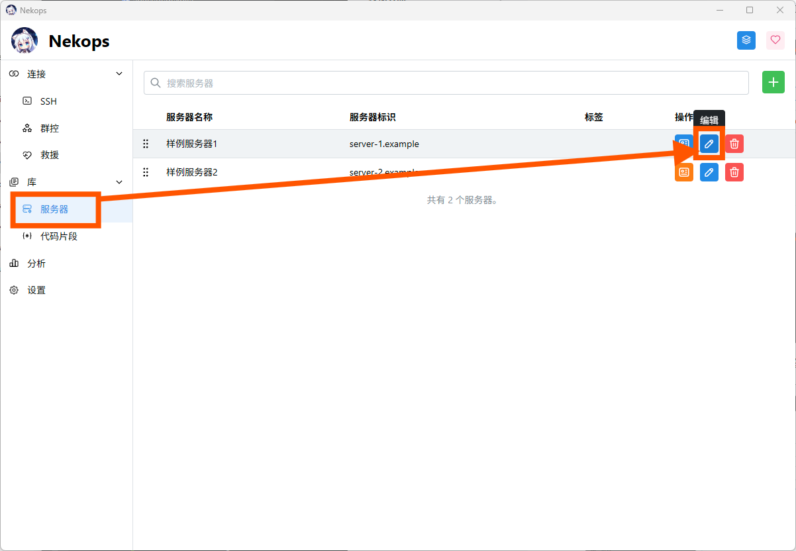

我们可以打开一个和新增服务器时候一样的表单。

点击顶上的 外部访问 按钮，切换到外部访问部分的设置：

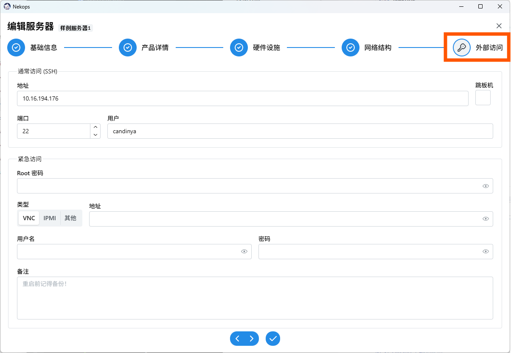

假设我们的服务器使用的紧急访问的方案如下：

- root 密码 `password`
- 类型 `VNC`
- 地址 `127.0.0.1:5900`
- 用户名 `vncuser`
- 密码 `vncpass`

编辑服务器，我们可以这样填写（这些区域是作为密码输入隐藏起来的，为了展示暂时关闭了隐藏）：

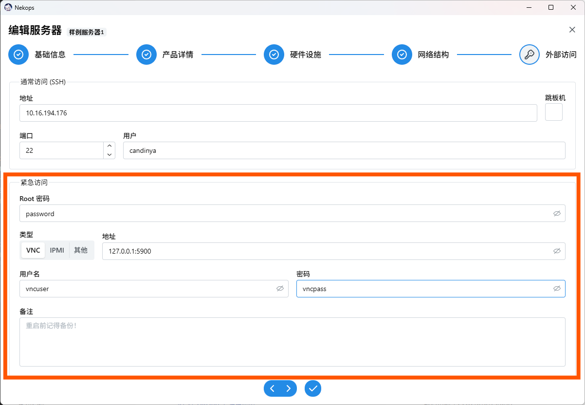

如果想要给紧急访问设置备注，也可以在这里直接设置。

完成编辑，保存，前往 救援 页面，点击服务器铭牌，我们就能看到刚刚填写的信息（密码被隐藏了，点击右侧的眼睛按钮可以显示）：

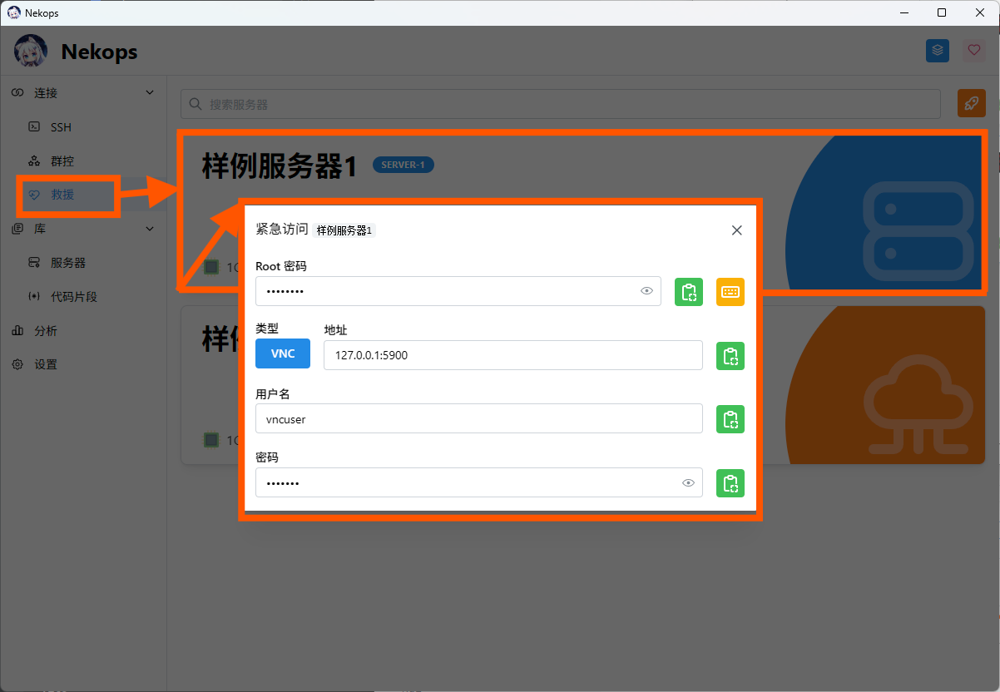

Nekops 针对 VNC 的方案提供了内置的客户端支持[^not-ready]，您可以点击 VNC 方法，来打开内置的 VNC 客户端：

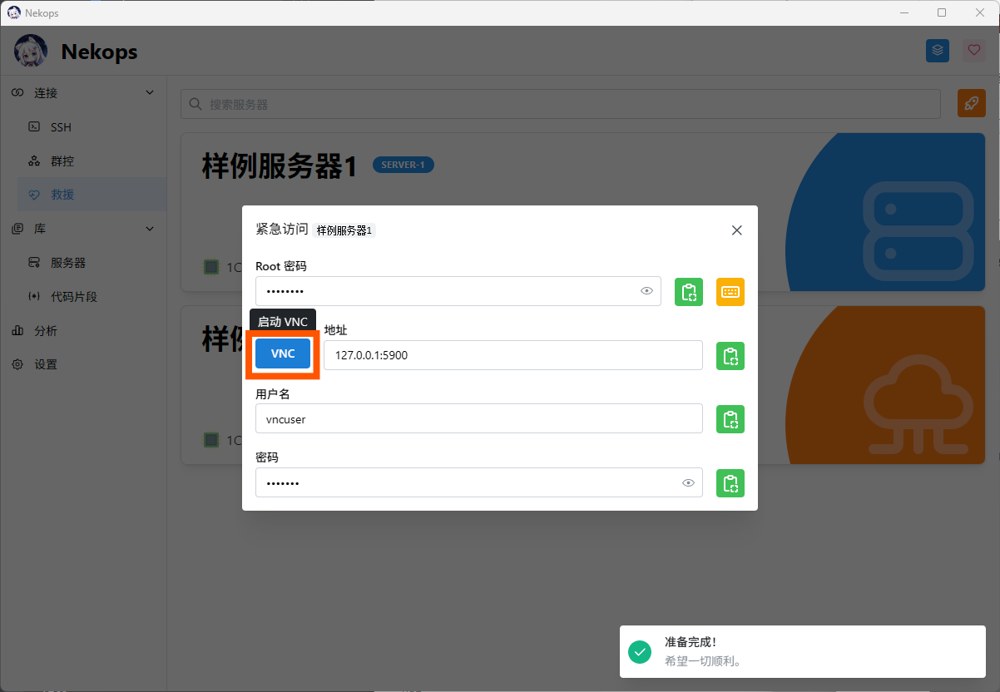

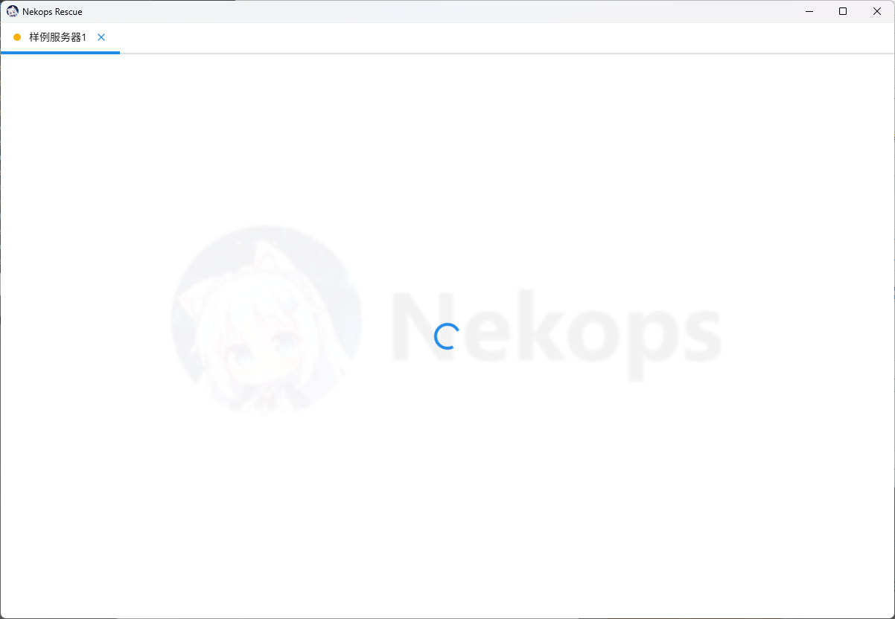

右键服务器标签页，可以看到更多选项：

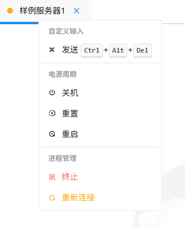

## 使用密码保护

如果您打开服务器的数据目录，您会发现在上文中填写的这些信息全部是以明文形式存储的：

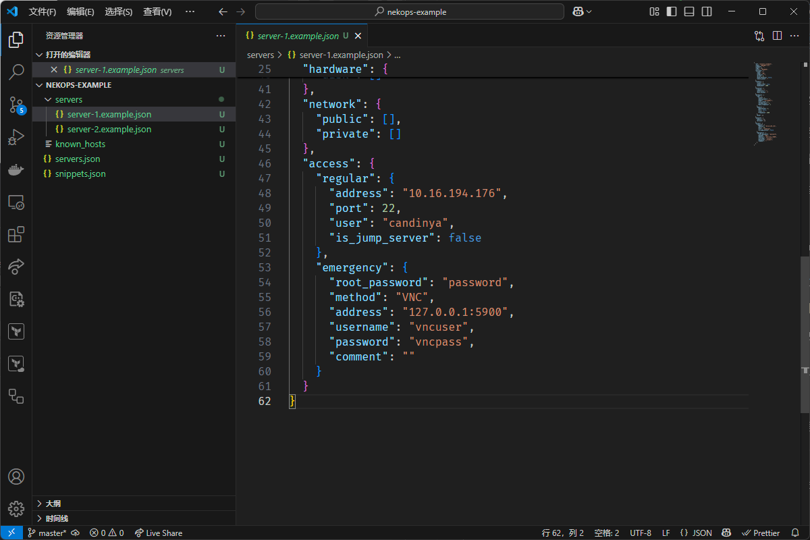

很显然，这样做是非常危险的：这些是非常底层的访问信息，知道这些信息的人可以绕过通常访问渠道设置的限制，直接和服务器建立连接。

为了解决这个问题， Nekops 引入了数据加密的概念，您可以设置一个密码来保护这些数据。

前往 设置 页面，向下滚动到 当前工作区 区域，我们可以看到一个密码输入框。

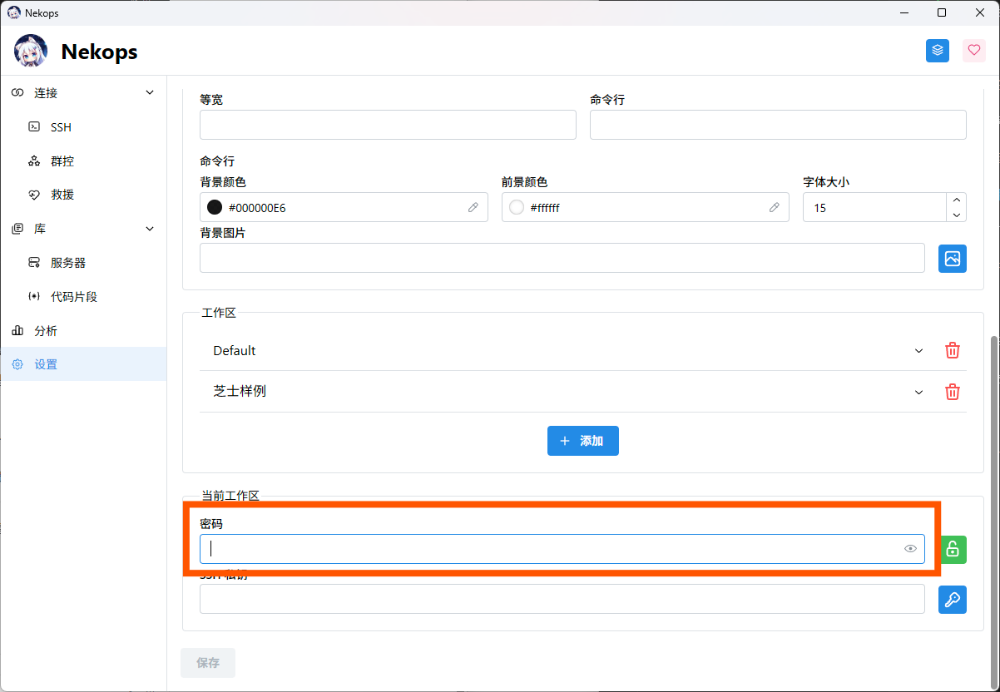

这个密码输入框控制的是当前的工作区是否加密。我们可以在密码输入框里输入想要设置的密码，再点击保存来应用它。

此时再前往工作区的数据目录，可以看见出现了一个名为 `public.key` 的文件，同时服务器的紧急访问信息也变成了 base64 编码的格式：

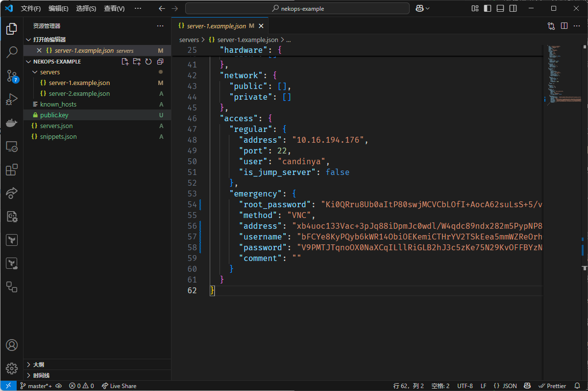

这表明加密已经被成功启用了。

当我们重新启动应用后，再前往 救援 页面，可以看见救援页面此时是锁定的状态：

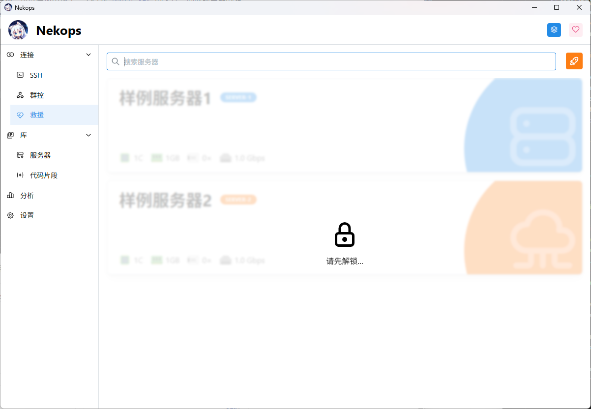

点击页面可以打开解锁密码输入框，输入解锁密码后点击 解锁 按钮：

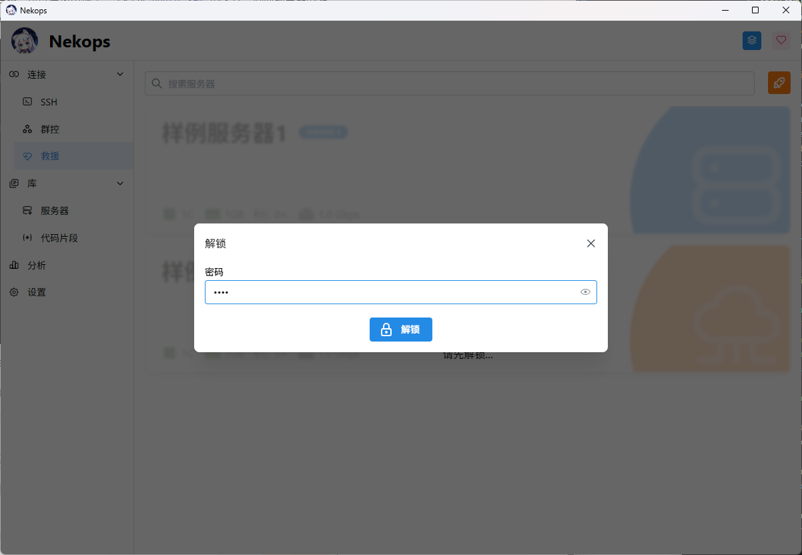

可以看到软件弹出解锁成功的提示，同时页面解锁，可以像之前那样查看服务器的救援信息了。

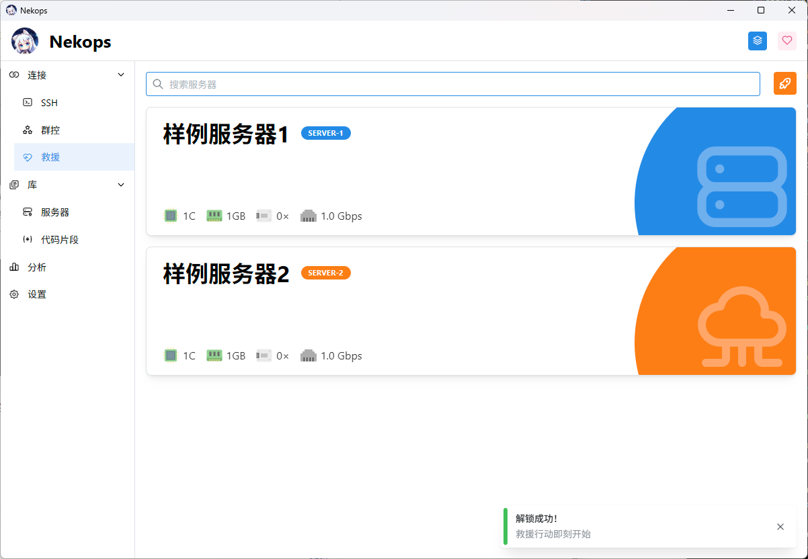

<!-- 脚注 -->

[^not-ready]: 因为我的服务器提供商的 VNC 支持有点问题，暂时还没调过，可能不是非常可用，之后的版本会尝试修复它的。
