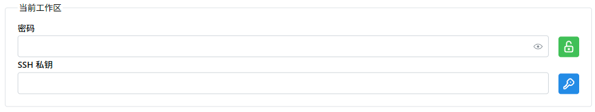

# 设置详解

当您修改设置后，如果保存按钮亮起，请使用保存按钮来保存新的设置。部分选项可能不需要保存即可生效。

## 通用

这里的设置是关于整个 Nekops 软件的基础状态。

### 语言
  
这里设置的是软件整体的界面语言，包括所有的文本、按钮、提示信息等。

需要注意的是，这个只是软件的语言，并不能管理您的服务器语言。例如，您的服务器语言为英文，那么将此处的语言设置为简体中文并不能让您的服务器以简体中文显示信息。

虽然相当一部分内容会在语言设置更改后直接生效，但由于各个组件的调用方式不同，依然存在一些需要重新启动软件才能生效的部分。我们还是建议您在更新语言选项后重启软件。

### 颜色主题
  
这里设置的是软件的颜色主题。

目前，软件提供两种颜色主题：**浅色** 和 **深色**。您可以选择您喜欢的颜色，或使用 **自动** 来跟随系统的颜色主题切换。

### 默认 SSH 行为

这里设置的是当点击服务器铭牌后，软件应该做什么。

如果您希望启动内置的客户端，那么请选择 **开始会话**。

如果您希望复制用于启动 OpenSSH 的指令，那么请选择 **复制指令**。

### 默认 SSH 客户端

这里设置的是当 开始会话 时，应该使用哪个客户端。

如果您希望获得更佳的体验，推荐您选择 **集成** 客户端。这个客户端在服务端密钥管理和窗口大小调整上包含了一些体验优化的功能，能让您使用得更舒心。

但如果您担忧集成客户端存在安全隐患，或是您使用的是集成客户端所不支持的功能，请选择 **系统** 。软件将会尝试调用系统的 `ssh` 指令来为您建立连接。

### 启动时检查更新

这里设置的是是否需要在软件启动的时候执行静默的更新检查。

一般保持默认的开启状态即可。如果您不需要这个功能，您可以将它关闭。

## 自定义

这里设置的是一些界面的自定义选项。

### 字体

这里设置的是软件的字体。如果您使用了和系统默认语言不同的语言，而使用系统字体无法保证为所有字符渲染提供支持，就会出现非常难看的字体错差问题。因此，您可以在这里指定需要使用的字体，以避免在使用时候感到恶心。

### 命令行

这里设置的是命令行界面的终端样式。通常来说使用默认设置就足够了，但您也可以选择自定义您喜欢的样式。

特别地，您可以为命令行视窗选择一张您喜欢的背景图片，以提升您使用时的心情。

## 工作区

这里管理所有的工作区。您可以参阅[一切皆在掌控中]部分了解更多。

[一切皆在掌控中]: /quickstart/everything-under-control/

## 当前工作区

这里是当前工作区的选项，包含[工作区的加密]密码和额外使用的 SSH 私钥（如果有需要指定的话）。

[工作区的加密]: /quickstart/rescue-server/#使用密码保护

