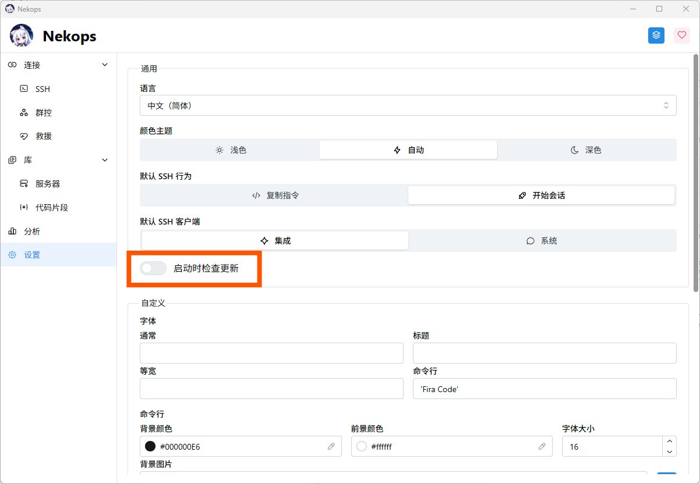
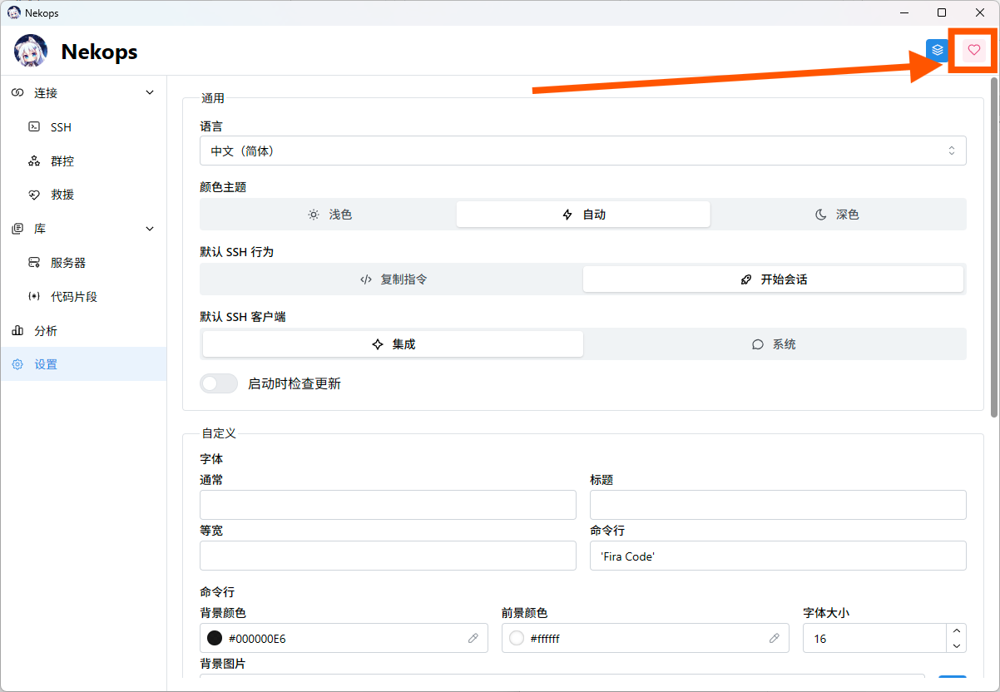
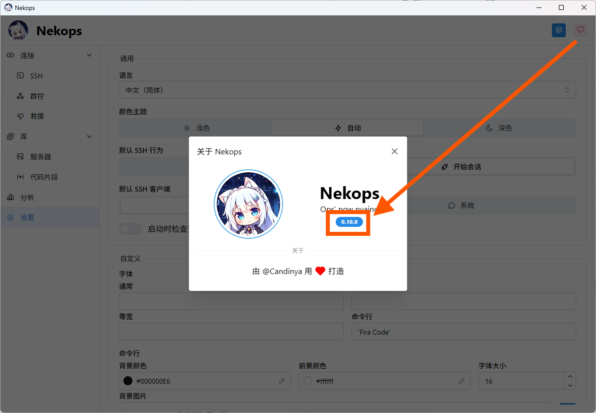
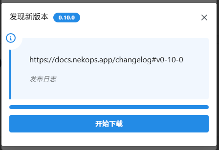

# 更新

软件已内置自动升级功能，您可以开启 **设置** 中的 `启动时检查更新` 选项，以在软件启动时自动静默检查是否有新的版本（有新版本或检查失败时会弹出提示，没有则不会有动作）。

如果您需要手动确认是否有新版本可供升级，您可以打开 **关于** 模态框后，点击 版本号 来手动检查更新。

如果检测到有更新的版本，软件会弹出版本更新模态框，其中包含新版本的发布日志（目前是链接格式，后续会进一步优化）。

您可以点击 开始下载 按钮开始下载更新文件，软件会自动完成更新流程。

由于网络环境未必稳定，如果您遇到下载失败的问题，您可以稍后再试一试，或是检查更新日志中是否有提到相关的问题。
